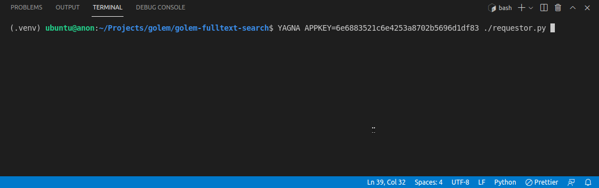

# Golem Full-text Search Engine

Golem Network is a cloud computing power service where everyone can develop, manage and execute workloads in an unstoppable, inexpensive and censorship-free environment.

Since Beta.2 Golem supports a new model of computation – services. In contrast with batch tasks, services are expected to be long-running processes that don't have any natural completion point but rather are started and stopped on explicit command. The goal of this project is to build a full-text search service on Golem. The service allows its users to perform search queries over a corpus of documents submitted by the requestor during deployment.

<h1 align="center">
	
</h1>

## Init

- python3 -m venv .venv
- pip install -r requirements.txt

## Build image

- cd service
- docker build -t golem-fulltext-search .
- gvmkit-build golem-fulltext-search:latest

## Publish image

- gvmkit-build golem-fulltext-search:latest --push
    - success. hash link ...
- replace `image_hash` with new hash link in `requestor.py`

## Run

- Run yagna daemon as described [here](https://handbook.golem.network/requestor-tutorials/flash-tutorial-of-requestor-development)
- YAGNA_APPKEY={YOUR_KEY} ./requestor.py 
    - (e.g. YAGNA_APPKEY=c6b87104451c45cc91e1e76204da75a4 ./requestor.py)

## Debug/test

- ./service/test.py

```
sudo ya-runtime-dbg \
    --runtime ~/.local/lib/yagna/plugins/ya-runtime-vm/ya-runtime-vm \
    --task-package docker-golem-fulltext-search-latest-cd09f6be53.gvmi \
    --workdir /tmp/workdir
```

## Examples

Some sample text files are located in `service/data/`

Entering the search term `golem` will return the following result:

```
[
   {
      "filename":"testfile3.txt",
      "lines":[
         {
            "line":1,
            "positions":[
               17,
               73
            ]
         }
      ]
   },
   {
      "filename":"testfile2.txt",
      "lines":[
         {
            "line":1,
            "positions":[
               13
            ]
         },
         {
            "line":0,
            "positions":[
               0
            ]
         }
      ]
   }
]
```

Entering the search term `network` will return the following result:

```
[
   {
      "filename":"testfile2.txt",
      "lines":[
         {
            "line":0,
            "positions":[
               6
            ]
         }
      ]
   }
]
```